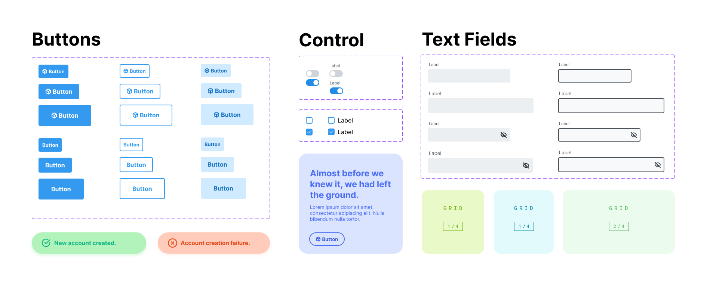

> **Warning**
> I am sorry to say that as of June 28 2023, DecaUI is no longer actively maintained.

<p align="center">
  <a href="https://deca-ui.com/" rel="noopener" target="_blank"></a>
  <h1 align="center">DecaUI</h1>
</p>
<p align="center">
  <a href="https://codecov.io/gh/deca-org/deca-ui">  
     
  </a>
  <a href="https://www.codacy.com/gh/deca-org/deca-ui/dashboard?utm_source=github.com&amp;utm_medium=referral&amp;utm_content=deca-org/deca-ui&amp;utm_campaign=Badge_Grade">
    
  </a>
  <a href="https://www.npmjs.com/package/@deca-ui/react">
    
  </a>
  <a href="https://github.com/deca-org/deca-ui/blob/main/LICENSE">
    
  </a>
</p>

<p>DecaUI provides a set of accessible and customizable React components that make it easy to quickly prototype and develop stunning websites.</p>

## Getting Started

```
npm install @deca-ui/react
```

## Using a component

Here is a simple example of a basic app using DecaUI's `Button` component:

```jsx
import { Button } from '@deca-ui/react';

function App() {
  return <Button variant="solid">Hello World</Button>;
}
```

#### [Click here for the full documentation](https://www.deca-ui.com/docs/guide/installation)

## What's so different about DecaUI

With DecaUI, developers can use the centralized theming system anywhere within their application with shorthand names for css properties.

### Custom CSS with other UI libraries

```jsx
<Box
  sx={{
    marginRight: '2rem',
    marginLeft: '2rem',
    marginTop: '2rem',
    marginBottom: '2rem',
  }}
>
  <Input placeholder="Email Address" />
  <Input placeholder="Password" />
  <Button
    sx={{
      width: '100%',
    }}
  >
    Create Account
  </Button>
</Box>
```

### Custom CSS with DecaUI

```jsx
<Box css={{ m: '$3' }}>
  <Input placeholder="Email Address" />
  <Input placeholder="Password" />
  <Button maxWidth>Create Account</Button>
</Box>
```

## Our focus is consistency

The main problem with other UI libraries is that it's confusing to create consistent webpage layouts with them. DecaUI allows developers to utilize a root theme object which serves properties following the [System UI](https://github.com/system-ui/theme-specification) specification.

## License


<a href="https://github.com/deca-org/deca-ui/blob/main/LICENSE">MIT @ Elliot Saha</a>

## Thank you React Status!
<div>

</div>
Thanks to <a href="https://react.statuscode.com/">React Status</a> for showcasing this project on their newsletter (issue <a href="https://react.statuscode.com/issues/323">#323</a>).


